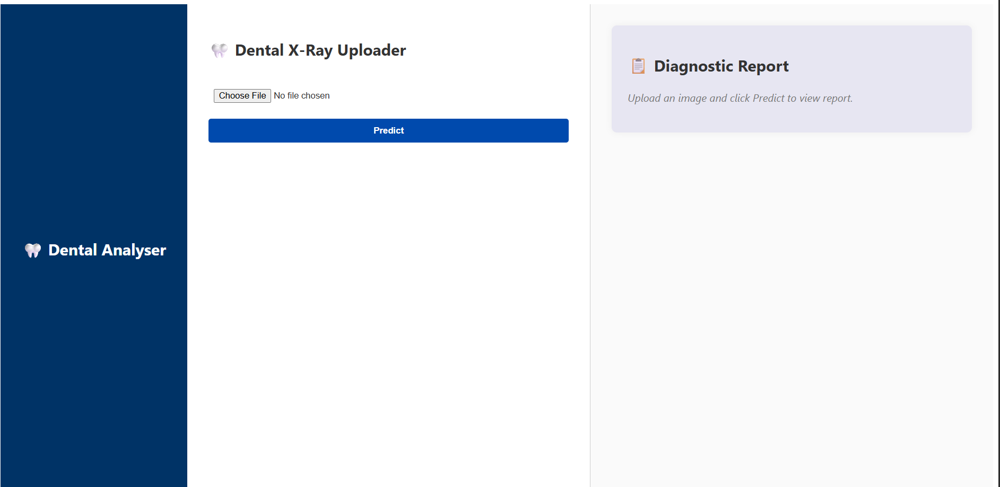
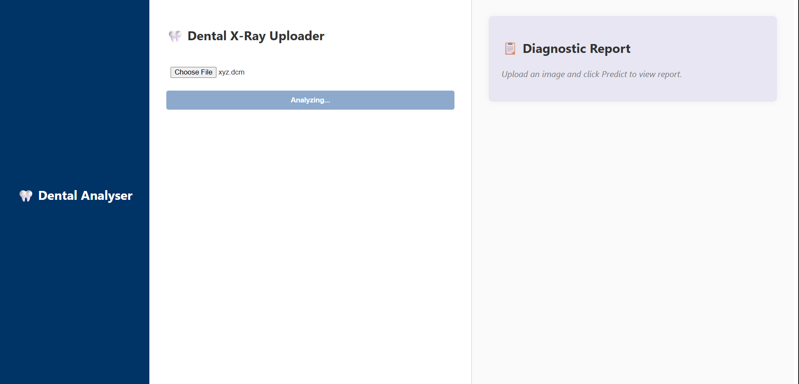
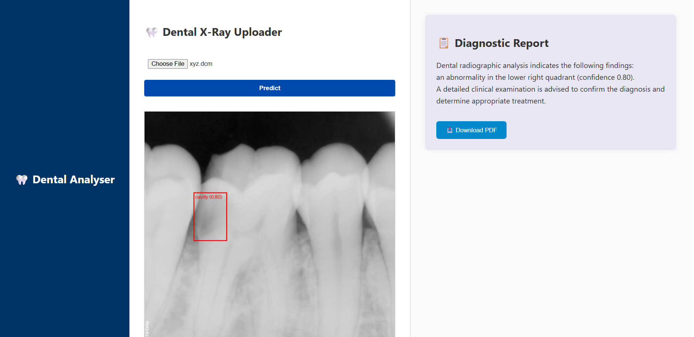

# 🦷 AI Dental Analyzer (ADA)

**AI Dental Analyzer (ADA)** is a full-stack web application designed to analyze dental X-ray images (DICOM/RVG format). It uses computer vision to detect pathologies and leverages GPT-4 to generate diagnostic reports. This tool helps automate and support dental professionals in preliminary X-ray interpretation.

---

## 📁 Features

### ✅ Core Functionalities
- 📤 Upload DICOM/RVG files (dental X-rays)
- 📸 Converts and displays X-ray as PNG with overlaid bounding boxes
- 🧠 Uses Roboflow Object Detection API to detect dental pathologies
- 📑 Uses OpenAI GPT-4 to generate detailed diagnostic reports
- 🖼️ Annotated image preview
- 📄 Download diagnostic report as a PDF
- 🔄 Loading spinners for API calls to improve UX
- 📦 Dockerized backend and frontend for deployment
- 🧪 Unit tests for backend endpoints

---

## 🛠️ Tech Stack

- **Frontend**: React.js
- **Backend**: FastAPI (Python)
- **Model APIs**: Roboflow (Object Detection), OpenAI GPT-4 (NLP)
- **Image Processing**: Pillow, pydicom
- **PDF Generation**: jsPDF
- **Deployment**: Docker

---

## 🚀 Getting Started

### 📂 Clone the Repository

```bash
git clone https://github.com/Tashu22-hub/X-ray-dental

##ATTACHED IMAGES - website looks like see images 




runnig backend code : uvicorn main:app --reload
output will be at  like : Uvicorn running on http://127.0.0.1:8000

running frontend code : npm run dev


